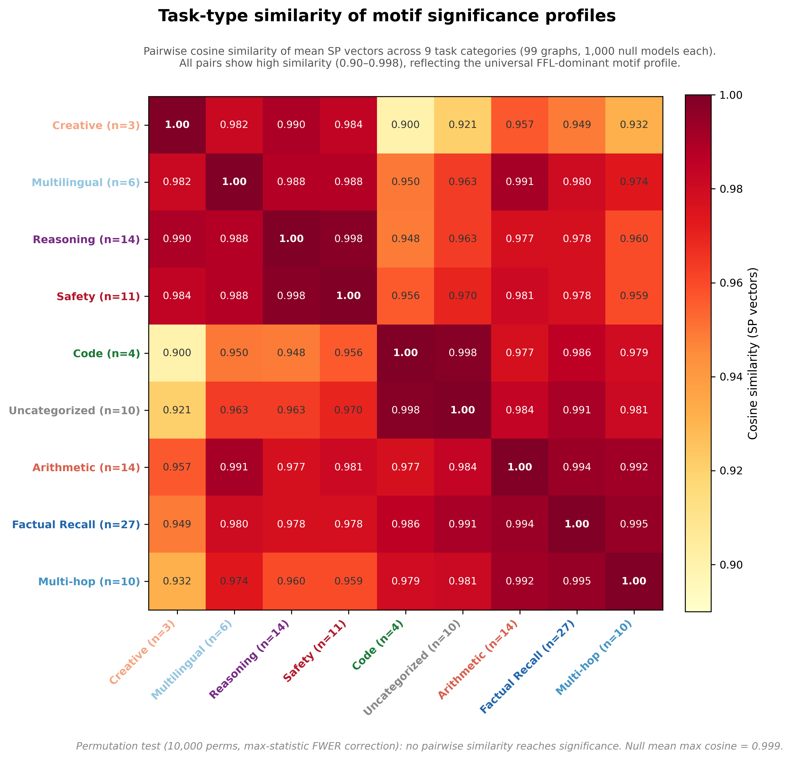
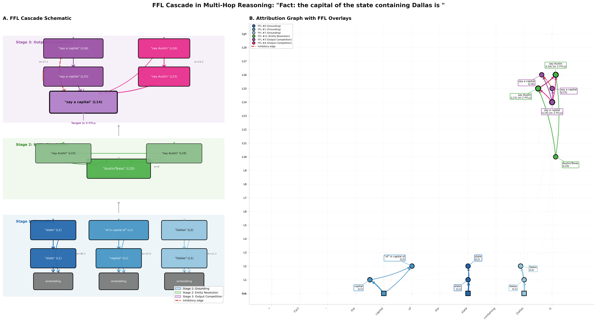
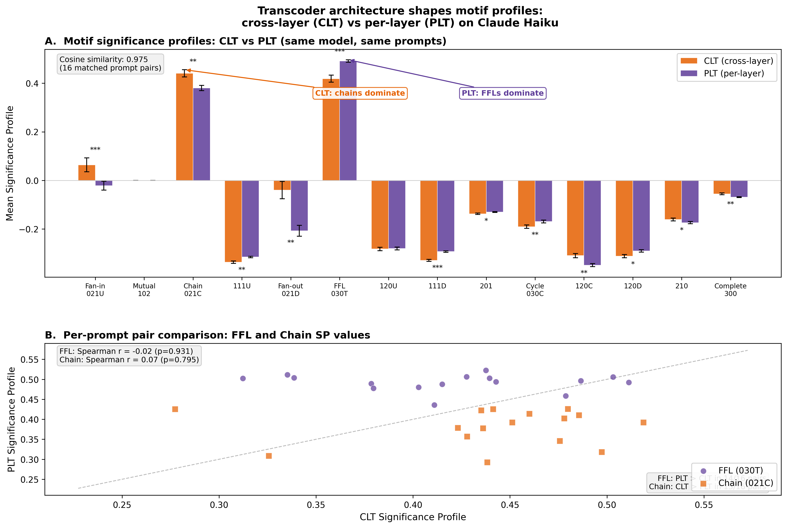
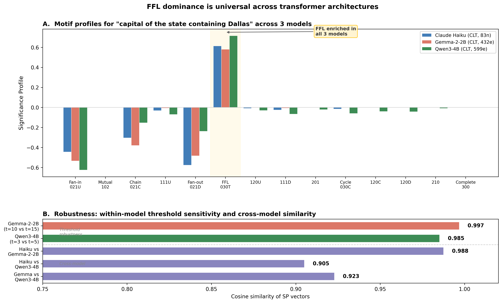
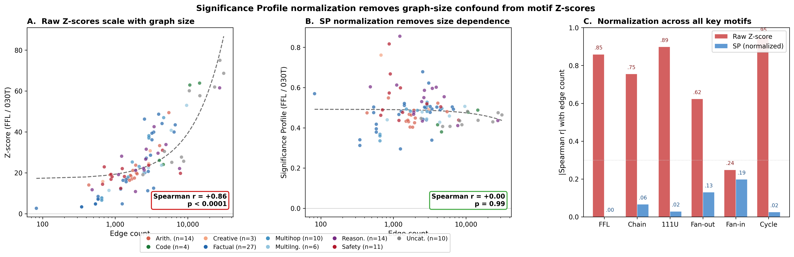

# circuit-motifs

**Network motif analysis of LLM attribution graphs** --- applying computational biology techniques (Milo et al., 2002) to mechanistic interpretability.


---

When LLMs process prompts, tools like Anthropic's [circuit-tracer](https://github.com/safety-research/circuit-tracer) extract **attribution graphs**: directed networks where nodes are transcoder features and edges are causal influence. These graphs are structurally analogous to biological regulatory networks.

**Network motifs** are small subgraph patterns (3--4 nodes) that appear significantly more or less often than expected by chance. In biology, motif profiles act as structural fingerprints. This project asks: **can motif profiles distinguish different types of LLM computation?**

This is the first application of network motif analysis to mechanistic interpretability.

## Key Result

<p align="center">
  
</p>

**Figure 2.** Z-score significance profiles across 99 attribution graphs from 9 task categories. Feedforward loops (030T) and chains (021C) are universally enriched; motifs with mutual edges are universally depleted.

## Quick Start

```bash
# Core library
pip install -e .

# With interactive explorer
pip install -e ".[app]"
```

Requires Python 3.10+.

## Usage

```python
from src import load_attribution_graph, compute_motif_census, MOTIF_FFL

# Load an attribution graph
g = load_attribution_graph("data/raw/multihop/capital-state-dallas.json")

# Motif census (size-3 triads)
result = compute_motif_census(g, size=3)
print(f"Feedforward loops: {result.counts[MOTIF_FFL]}")

# Null model + Z-scores (100 degree-preserving rewirings)
from src import generate_configuration_null
null_result = generate_configuration_null(g, n_random=100)
print(f"FFL Z-score: {null_result.z_scores[MOTIF_FFL]:.1f}")

# Find specific motif instances (VF2 subgraph isomorphism)
from src import find_motif_instances
instances = find_motif_instances(g, MOTIF_FFL)
print(f"Found {len(instances)} feedforward loop instances")

# Visualize top instance in Neuronpedia style
from src import plot_top_motif
fig, instance = plot_top_motif(g, MOTIF_FFL, rank=0, figsize=(18, 14))
```

### Interactive Explorer

```bash
streamlit run app.py
```

### Full Pipeline

```bash
python -m src.pipeline --data-dir data/raw --results-dir data/results --n-random 100
```

## Key Findings (99 graphs, 9 task categories)

**Universal structural signature** across all LLM attribution graphs:

| Motif | Name | Mean Z | % Enriched | % Depleted | Interpretation |
|-------|------|--------|------------|------------|----------------|
| 030T | Feedforward loop | +26.2 | 100% | 0% | Convergent evidence / signal filtering |
| 021C | Chain | +20.1 | 96% | 1% | Sequential processing |
| 111U | Regulated fan-in | -17.4 | 0% | 99% | Mutual connections avoided |
| 120C | Regulated chain | -17.2 | 0% | 99% | Regulated mutual patterns depleted |
| 021D | Fan-out | -11.1 | 7% | 81% | Broadcasting suppressed |
| 021U | Fan-in | -0.5 | 33% | 36% | Most variable --- task-dependent |

**Cross-task variation:** 11 of 16 motif classes show statistically significant differences across task categories (Kruskal-Wallis p < 0.05).

**Task similarity:** Code and reasoning circuits are most similar (cosine sim 0.998). Code and creative are most different (0.902).

<p align="center">
  
</p>

**Figure 4.** Mean Z-score heatmap by task category. Rows are tasks, columns are motif classes.

## Method

```
Prompt
  --> circuit-tracer --> Attribution Graph (JSON)
    --> Parse to igraph DiGraph (remove error nodes, threshold edges)
    --> Triad census (16 isomorphism classes for size-3 subgraphs)
    --> 1,000 degree-preserving random rewirings (configuration model)
    --> Z-scores per motif class
    --> Significance Profile (normalized Z-score vector)
    --> Cross-task comparison (cosine similarity, Mann-Whitney U, Kruskal-Wallis)
```

**Data sources:**
- [Anthropic's circuit-tracing paper](https://transformer-circuits.pub/2025/attribution-graphs/methods.html) --- 99 pre-published attribution graphs
- [Neuronpedia API](https://neuronpedia.org/api-doc) --- community-generated graphs (gemma-2-2b, qwen3-4b, gemma-3-4b-it)

## Project Structure

```
circuit-motifs/
├── app.py                      # Streamlit interactive explorer
├── pyproject.toml
├── src/
│   ├── graph_loader.py         # Parse circuit-tracer JSON --> igraph DiGraph
│   ├── motif_census.py         # Motif enumeration + instance finding (VF2)
│   ├── null_model.py           # Degree-preserving randomization + Z-scores
│   ├── comparison.py           # Cross-task SP vectors, statistical tests
│   ├── visualization.py        # Motif profiles, heatmaps, Neuronpedia-style graphs
│   ├── pipeline.py             # Full analysis pipeline for batch processing
│   └── neuronpedia_client.py   # Fetch graphs from Neuronpedia / Anthropic bucket
├── notebooks/
│   ├── 01_exploration.ipynb
│   ├── 02_single_graph.ipynb
│   ├── 03_factual_vs_multihop.ipynb
│   ├── 04_figures.ipynb
│   ├── 05_motif_instance_demo.ipynb
│   └── 06_full_analysis.ipynb
├── figures/
│   ├── fig2_motif_profile.png
│   ├── fig4_task_heatmap.png
│   ├── fig_ffl_cascade.png
│   ├── fig_clt_vs_plt.png
│   ├── fig_cross_model.png
│   ├── generate_fig2_motif_profile.py
│   └── generate_fig4_task_heatmap.py
├── tests/
│   ├── test_graph_loader.py
│   ├── test_motif_census.py
│   ├── test_motif_instances.py
│   └── test_null_model.py
└── data/                       # Raw JSON graphs (not committed)
```

## Figures Gallery

| | |
|---|---|
|  |  |
| **Fig 2.** Significance profiles (99 graphs) | **Fig 4.** Task-level Z-score heatmap |
|  |  |
| **Fig 5.** FFL cascade in multi-hop reasoning | **Fig 7.** CLT vs PLT transcoder comparison |
|  |  |
| **Fig 8.** Cross-model motif universality | **Fig 6.** Size normalization controls |

## References

- Milo, R. et al. (2002). "Network motifs: simple building blocks of complex networks." *Science* 298(5594), 824--827.
- Milo, R. et al. (2004). "Superfamilies of evolved and designed networks." *Science* 303(5663), 1538--1542.
- Mangan, S. & Alon, U. (2003). "Structure and function of the feed-forward loop network motif." *PNAS* 100(21), 11980--11985.
- Alon, U. (2007). *An Introduction to Systems Biology.* Chapman & Hall/CRC.
- Wernicke, S. & Rasche, F. (2006). "FANMOD: a tool for fast network motif detection." *Bioinformatics* 22(9), 1152--1153.
- Ameisen, E. et al. (2025). "Circuit Tracing: Revealing Computational Graphs in Language Models." Anthropic.
- Lindsey, J. et al. (2025). "The Biology of a Large Language Model." Anthropic.
- Conmy, A. et al. (2023). "Towards Automated Circuit Discovery for Mechanistic Interpretability." (ACDC)

## License

MIT. See [LICENSE](LICENSE).
