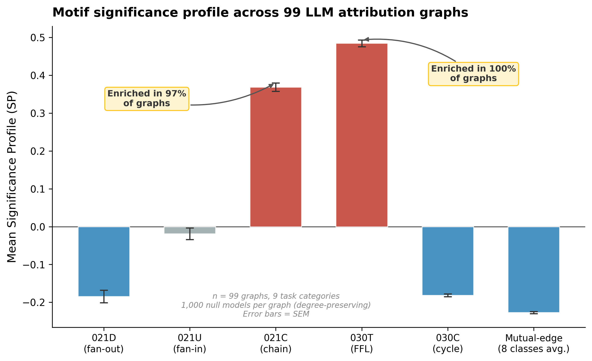

# circuit-motifs

**Network motif analysis of LLM attribution graphs** --- applying computational biology techniques (Milo et al., 2002) to mechanistic interpretability.


---

When LLMs process prompts, tools like Anthropic's [circuit-tracer](https://github.com/safety-research/circuit-tracer) extract **attribution graphs**: directed networks where nodes are transcoder features and edges are causal influence. These graphs are structurally analogous to biological regulatory networks.

**Network motifs** are small subgraph patterns (3--4 nodes) that appear significantly more or less often than expected by chance. In biology, motif profiles act as structural fingerprints. This project asks: **can motif profiles distinguish different types of LLM computation?**

### Key Finding



*Feedforward loops (030T) are universally enriched (mean Z = +26.2) while mutual-connection motifs (111U, 120C) are systematically depleted --- a structural signature shared across all task types.*


## Installation

```bash
# Core library
pip install -e .

# With interactive explorer
pip install -e ".[app]"
```

Requires Python 3.10+.

## Quick Start

Two example attribution graphs are bundled in `data/examples/` so you can try the library immediately:

```python
from src import load_attribution_graph, compute_motif_census, generate_configuration_null, MOTIF_FFL

# Load a bundled example graph
g = load_attribution_graph("data/examples/capital-state-dallas.json")

# Motif census (size-3 triads)
result = compute_motif_census(g, size=3)
print(f"Feedforward loops: {result.raw_counts[MOTIF_FFL]}")

# Null model + Z-scores (1,000 degree-preserving rewirings)
null_result = generate_configuration_null(g, n_random=1000)
print(f"FFL Z-score: {null_result.z_scores[MOTIF_FFL]:.1f}")

# Find specific motif instances (VF2 subgraph isomorphism)
from src import find_motif_instances
instances = find_motif_instances(g, MOTIF_FFL)
print(f"Found {len(instances)} feedforward loop instances")

# Visualize top instance in Neuronpedia style
from src import plot_top_motif
fig, instance = plot_top_motif(g, MOTIF_FFL, rank=0, figsize=(18, 14))
```

### Downloading the Full Dataset

To download all 99 attribution graphs from the Anthropic circuit-tracing paper (no API key needed):

```python
from src.neuronpedia_client import NeuronpediaClient
client = NeuronpediaClient()
client.download_all_anthropic_graphs("data/raw", categorize=True)
```

Or generate a new graph via Neuronpedia (runs on their GPUs, no local GPU needed):

```python
result = client.generate_and_save("The capital of France is", "data/raw/custom")
```

### Interactive Explorer

Requires downloading the full dataset first (see above), then:

```bash
streamlit run app.py
```

### Full Pipeline

Run the complete analysis across all graphs:

```bash
python -m src.pipeline --data-dir data/raw --results-dir data/results --n-random 1000
```

This produces `analysis_summary.json` with per-graph Z-scores, significance profiles, cross-task statistics, and pairwise comparisons.

## How It Works

```
Prompt
  --> circuit-tracer --> Attribution Graph (JSON)
    --> Parse to igraph DiGraph (remove error nodes, threshold edges)
    --> Triad census (16 isomorphism classes for size-3 subgraphs)
    --> N degree-preserving random rewirings (configuration model)
    --> Z-scores per motif class
    --> Significance Profile (normalized Z-score vector)
    --> Cross-task comparison (cosine similarity, Mann-Whitney U, Kruskal-Wallis)
```

### Modules

| Module | Description |
|--------|-------------|
| `graph_loader.py` | Parse circuit-tracer JSON into igraph DiGraph. Handles both CLT and PLT transcoders, removes error nodes, applies optional edge weight thresholds. |
| `motif_census.py` | Motif enumeration via `igraph.motifs_randesu()`. Instance finding via VF2 subgraph isomorphism with deduplication and weight-based ranking. |
| `null_model.py` | Degree-preserving randomization (`igraph.rewire()`). Computes Z-scores and significance profiles (SP) against a configurable null ensemble. |
| `comparison.py` | Cross-task SP vector aggregation, cosine similarity matrices, Mann-Whitney U pairwise tests, Kruskal-Wallis across categories. |
| `visualization.py` | Neuronpedia-style attribution graph drawing with motif highlighting, Z-score bar charts, heatmaps, and dendrograms. |
| `pipeline.py` | Batch processing: runs the full analysis across all graphs in a directory and produces JSON + pickle outputs. |
| `neuronpedia_client.py` | Fetch attribution graphs from the Neuronpedia API or Anthropic's public S3 bucket. |

### Key Concepts

- **Triad census**: For directed graphs, there are 16 isomorphism classes of size-3 subgraphs. Key types include fan-out (021D), fan-in (021U), chain (021C), feedforward loop (030T), and cycle (030C).
- **Configuration model null**: Degree-preserving edge rewiring generates random graphs that preserve the in/out degree of every node. Z-scores measure how many standard deviations a motif count deviates from this null.
- **Significance Profile (SP)**: Normalized Z-score vector `SP_i = Z_i / sqrt(sum(Z_j^2))` that removes graph-size dependence, making profiles comparable across networks of different scales.

### Data Sources

- [Anthropic's circuit-tracing paper](https://transformer-circuits.pub/2025/attribution-graphs/methods.html) --- pre-published attribution graphs
- [Neuronpedia API](https://neuronpedia.org/api-doc) --- community-generated graphs (gemma-2-2b, qwen3-4b, gemma-3-4b-it)

## Project Structure

```
circuit-motifs/
├── app.py                      # Streamlit interactive explorer
├── pyproject.toml
├── src/
│   ├── graph_loader.py         # Parse circuit-tracer JSON --> igraph DiGraph
│   ├── motif_census.py         # Motif enumeration + instance finding (VF2)
│   ├── null_model.py           # Degree-preserving randomization + Z-scores
│   ├── comparison.py           # Cross-task SP vectors, statistical tests
│   ├── visualization.py        # Motif profiles, heatmaps, Neuronpedia-style graphs
│   ├── pipeline.py             # Full analysis pipeline for batch processing
│   └── neuronpedia_client.py   # Fetch graphs from Neuronpedia / Anthropic bucket
├── notebooks/                  # Exploration and analysis notebooks
├── figures/                    # Figure generation scripts and outputs
├── tests/                      # pytest test suite
└── data/                       # Raw JSON graphs and pipeline outputs (not committed)
```

## Tests

```bash
pytest
```

## References

- Milo, R. et al. (2002). "Network motifs: simple building blocks of complex networks." *Science* 298(5594), 824--827.
- Milo, R. et al. (2004). "Superfamilies of evolved and designed networks." *Science* 303(5663), 1538--1542.
- Mangan, S. & Alon, U. (2003). "Structure and function of the feed-forward loop network motif." *PNAS* 100(21), 11980--11985.
- Ameisen, E. et al. (2025). "Circuit Tracing: Revealing Computational Graphs in Language Models." Anthropic.
- Lindsey, J. et al. (2025). "The Biology of a Large Language Model." Anthropic.

## Citation

If you use this code in your research, please cite:

```bibtex
@software{kenney2026circuitmotifs,
  author = {Kenney, Michael},
  title = {circuit-motifs: Network Motif Analysis of LLM Attribution Graphs},
  year = {2026},
  url = {https://github.com/mkenney2/circuit-motifs},
  license = {MIT}
}
```

## License

MIT. See [LICENSE](LICENSE).
