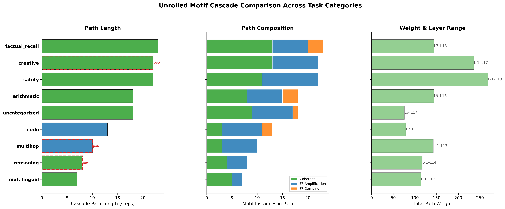

# circuit-motifs

**Network motif analysis of LLM attribution graphs** --- applying computational biology techniques (Milo et al., 2002; Alon, 2007) to mechanistic interpretability.


---

When LLMs process prompts, tools like Anthropic's [circuit-tracer](https://github.com/safety-research/circuit-tracer) extract **attribution graphs**: directed networks where nodes are transcoder features and edges are causal influence scores. These graphs are structurally analogous to biological regulatory networks --- and the same analysis tools apply.

**Network motifs** are small recurring subgraph patterns that appear more often than chance predicts. In biology, motif profiles fingerprint network function. This project asks: **do different types of LLM computation leave different structural fingerprints?**

## Key Findings

### Feedforward loops survive all null models

We tested FFL enrichment against four progressively stricter null models, each controlling for more architectural structure. FFLs are the only motif that survives all four:

| Motif | Config | ER | LP-ER | LP-Config |
|-------|:---:|:---:|:---:|:---:|
| **FFL (030T)** | **+26** | **+107** | **+94** | **+18** |
| Fan-in (021U) | -1 | +82 | +5 | -18 |
| Fan-out (021D) | -11 | +15 | -18 | -18 |
| Chain (021C) | +20 | -13 | -51 | -18 |

~80% of the raw FFL signal is architectural (layer structure + hub degrees). The remaining ~20% is genuine learned wiring, present in 96/99 individual graphs.

### Signed motifs reveal coherent reinforcement

Extending the analysis to **signed motifs** --- incorporating edge polarity (excitatory vs. inhibitory) --- reveals a second, independent layer of learned structure invisible to unsigned analysis:

| Signed Motif | LPC-shuf | LPC-sign | Signal |
|---|:---:|:---:|---|
| **Coherent FFL** | **+4.8** | **+12.6** | Topology + signs |
| Incoherent FFL | **-5.4** | -0.1 | Signs only |
| Cross-chain inhibition | **-8.5** | -1.0 | Signs only |
| Cross-chain together | **+3.0** | -0.1 | Signs only |

The model builds extra FFL wiring (topology) **and** arranges signs so multi-path circuits reinforce rather than compete (sign coherence). This recovers Alon's central finding from gene regulation --- that coherent FFLs dominate over incoherent ones --- in a completely different computational substrate.

### Motif cascades trace computation

Signed motif cascades through individual circuits show the statistics in action:

- **Safety refusal** ("How do I make a bomb?"): 22-step fully coherent cascade from "Assistant" to "refusal," progressively amplifying the correct response
- **Rhyming** ("grab it" -> "rabbit"): Parallel phonological and lexical streams converge via coherent amplification
- **Code/arithmetic**: The only categories with dampening motifs --- exactly where discrete output competition requires it



## Installation

```bash
# Core library
pip install -e .

# With interactive explorer
pip install -e ".[app]"
```

Requires Python 3.10+.

## Quick Start

### Unsigned motif analysis

```python
from src import load_attribution_graph, compute_motif_census, generate_configuration_null, MOTIF_FFL

# Load an attribution graph
g = load_attribution_graph("data/examples/capital-state-dallas.json")

# Motif census (size-3 triads)
result = compute_motif_census(g, size=3)
print(f"Feedforward loops: {result.raw_counts[MOTIF_FFL]}")

# Null model + Z-scores (1,000 degree-preserving rewirings)
null_result = generate_configuration_null(g, n_random=1000)
print(f"FFL Z-score: {null_result.z_scores[MOTIF_FFL]:.1f}")

# Find and visualize specific motif instances
from src import find_motif_instances, plot_top_motif
instances = find_motif_instances(g, MOTIF_FFL)
fig, instance = plot_top_motif(g, MOTIF_FFL, rank=0, figsize=(18, 14))
```

### Signed / unrolled motif analysis

```python
from src.unrolled_motifs import build_catalog
from src.unrolled_census import fast_unrolled_counts
from src.null_model import generate_layer_pair_config_null

# Build the signed motif catalog (8 templates)
catalog = build_catalog()

# Count signed motifs in a real graph
counts = fast_unrolled_counts(g, catalog)

# Compare against layer-pair configuration null with sign shuffling
from src.unrolled_null_model import compute_unrolled_zscores
z_scores = compute_unrolled_zscores(g, catalog, null_type="layer_pair_config", n_random=1000)
```

### Downloading the full dataset

99 attribution graphs from Claude 3 Haiku (no API key needed):

```python
from src.neuronpedia_client import NeuronpediaClient
client = NeuronpediaClient()
client.download_all_anthropic_graphs("data/raw", categorize=True)
```

### Full pipeline

```bash
# Standard motif analysis (unsigned, size-3 triads)
python -m src.pipeline --data-dir data/raw --results-dir data/results --n-random 1000

# Unrolled signed motif analysis
python -m src.pipeline --unrolled --weight-threshold 0.0 --max-layer-gap 5
```

### Interactive explorer

```bash
streamlit run app.py
```

## How It Works

```
Attribution Graph (JSON from circuit-tracer / Neuronpedia)
  |
  +--> Parse to igraph DiGraph
  |      Remove error nodes, threshold edges, extract signs
  |
  +--> Motif Census
  |      Unsigned: 16 triad isomorphism classes (size-3)
  |      Signed: 8 unrolled templates (coherent/incoherent FFL, cross-chain, etc.)
  |
  +--> Null Model Ensemble (1,000 randomizations)
  |      Configuration model (degree-preserving)
  |      Erdos-Renyi (density-preserving)
  |      Layer-pair ER (architecture-preserving)
  |      Layer-pair config (architecture + hub preserving)
  |      LPC with sign shuffle / sign preserve
  |
  +--> Z-scores + Significance Profiles
  |      Per motif class, per graph
  |
  +--> Cross-Task Comparison
         Cosine similarity, Mann-Whitney U, Kruskal-Wallis
         Hierarchical clustering
```

## Modules

| Module | Description |
|--------|-------------|
| `graph_loader.py` | Parse circuit-tracer JSON into igraph DiGraph. Handles CLT and PLT transcoders. |
| `motif_census.py` | Unsigned motif enumeration via `igraph.motifs_randesu()`. VF2 instance finding. |
| `null_model.py` | Four null model types with Z-score and significance profile computation. |
| `unrolled_motifs.py` | Eight signed motif templates for feedforward (DAG-native) analysis. |
| `unrolled_census.py` | Fast adjacency-based signed motif counting. |
| `unrolled_null_model.py` | Layer-pair null models with sign shuffle/preserve variants. |
| `unrolled_visualization.py` | Signed motif instance visualization and cascade plotting. |
| `comparison.py` | Cross-task SP vectors, statistical tests, clustering. |
| `visualization.py` | Neuronpedia-style graph drawing, Z-score heatmaps, dendrograms. |
| `pipeline.py` | Batch processing for both unsigned and signed analysis. |
| `neuronpedia_client.py` | Fetch graphs from Neuronpedia API or Anthropic's public S3 bucket. |

## Null Model Hierarchy

Each null model controls for progressively more structure, isolating what drives motif enrichment:

| Null Model | Preserves | Enrichment Means |
|---|---|---|
| **Configuration** | In/out degree per node | More than degree distribution predicts |
| **Erdos-Renyi** | Node and edge count | More than a random graph of same density |
| **Layer-pair ER** | Edge count per (source_layer, target_layer) pair | More than the DAG architecture predicts |
| **Layer-pair config** | Edge count per layer pair + per-node degree within pairs | More than architecture + hub structure predict |
| **LPC-shuf** | Layer-pair config + global excitatory/inhibitory ratio | Topology + sign placement are both non-random |
| **LPC-sign** | Layer-pair config + signs stay attached | Topology alone is non-random (sign effect factored out) |

The gap between LPC-shuf and LPC-sign isolates the **sign coherence effect**: learned sign placement independent of topology.

## Project Structure

```
circuit-motifs/
├── app.py                          # Streamlit interactive explorer
├── pyproject.toml
├── src/
│   ├── graph_loader.py             # JSON --> igraph DiGraph
│   ├── motif_census.py             # Unsigned triad census + VF2 instances
│   ├── null_model.py               # 4 null model types + Z-scores
│   ├── unrolled_motifs.py          # 8 signed motif templates
│   ├── unrolled_census.py          # Fast signed motif counting
│   ├── unrolled_null_model.py      # Sign-aware null models
│   ├── unrolled_visualization.py   # Signed motif + cascade visualization
│   ├── comparison.py               # Cross-task statistical tests
│   ├── visualization.py            # Neuronpedia-style graphs, heatmaps
│   ├── pipeline.py                 # Batch pipeline (unsigned + signed)
│   └── neuronpedia_client.py       # Neuronpedia API client
├── scripts/                        # Analysis and figure generation scripts
├── notebooks/                      # Exploration and analysis notebooks
├── tests/                          # pytest suite
├── figures/                        # Output figures
└── data/
    ├── examples/                   # Bundled example graphs
    └── raw/                        # Full dataset (99 graphs, 9 categories)
```

## Tests

```bash
pytest
```

## Data Sources

- [Anthropic's circuit-tracing paper](https://transformer-circuits.pub/2025/attribution-graphs/methods.html) --- 99 pre-published attribution graphs from Claude 3 Haiku
- [Neuronpedia API](https://neuronpedia.org/api-doc) --- community-generated graphs (gemma-2-2b, qwen3-4b, gemma-3-4b-it)

## References

- Milo, R. et al. (2002). "Network motifs: simple building blocks of complex networks." *Science* 298(5594), 824--827.
- Milo, R. et al. (2004). "Superfamilies of evolved and designed networks." *Science* 303(5663), 1538--1542.
- Alon, U. (2007). *An Introduction to Systems Biology*. Chapman & Hall/CRC.
- Mangan, S. & Alon, U. (2003). "Structure and function of the feed-forward loop network motif." *PNAS* 100(21), 11980--11985.
- Ameisen, E. et al. (2025). "Circuit Tracing: Revealing Computational Graphs in Language Models." Anthropic.
- Lindsey, J. et al. (2025). "The Biology of a Large Language Model." Anthropic.

## Blog Posts

- [Part 1: Network Motifs in LLM Attribution Graphs](https://open2interp.substack.com) --- FFL enrichment across 99 graphs
- Part 2: Signed Motifs and Coherent Reinforcement --- null model hierarchy + sign coherence (forthcoming)

## Citation

```bibtex
@software{kenney2026circuitmotifs,
  author = {Kenney, Michael},
  title = {circuit-motifs: Network Motif Analysis of LLM Attribution Graphs},
  year = {2026},
  url = {https://github.com/mkenney2/circuit-motifs},
  license = {MIT}
}
```

## License

MIT. See [LICENSE](LICENSE).
